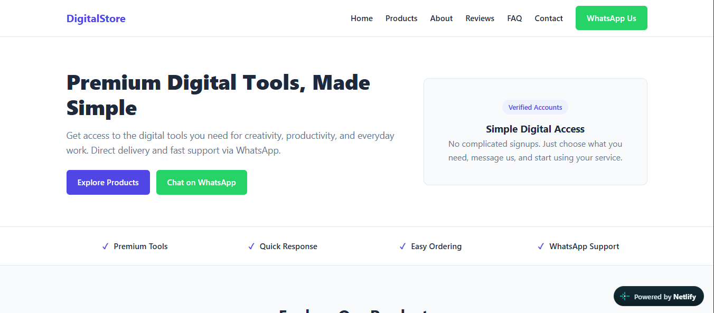

# 🛍️ DigitalStore — Digital Tools & Services Store

> A clean, lightweight multi-page business website for DigitalStore — offering premium digital subscriptions including Canva Pro, CapCut Pro, ChatGPT, Gemini, VPN and Microsoft 365 — with WhatsApp-based ordering. Built with pure HTML, CSS and inline Vanilla JavaScript. No frameworks, no dependencies, no build tools.

---

## 🌐 Live Demo

🔗 **[View Live Site](https://precious-kulfi-86b8a1.netlify.app/)**

---

## 📸 Preview



---

## ✨ Features

### 🎨 Design & Layout
- **Sticky Navbar** — fixed header with logo, nav links and WhatsApp button
- **Mobile Hamburger Menu** — toggle button with smooth open/close, auto-closes on link click
- **Hero Section** — bold headline, description, dual CTA buttons and a right-side visual card
- **Benefits Bar** — 4-point quick trust strip below hero
- **Products Section** — 6 product cards in a responsive grid, each with a pre-filled WhatsApp order button
- **Why Choose Us** — 4 feature cards in a clean grid
- **How It Works** — numbered 3-step process guide
- **About Section** — two-column layout with mission statement and highlights checklist
- **Customer Reviews** — 3 review cards with star ratings and reviewer names
- **FAQ Accordion** — 5 questions with expand/collapse toggle and +/− icon swap
- **Contact CTA** — full-width call-to-action with WhatsApp button
- **Footer** — 4-column grid with brand, quick links, products and contact info
- **Contact Page** — dedicated `contact.html` with contact channels + full contact form

### ⚡ JavaScript Features
- **Mobile Menu Toggle** — `classList.toggle('open')` on hamburger click, auto-closes on nav link click
- **FAQ Accordion** — `classList.toggle('active')` with +/− icon swap, multiple items can be open simultaneously
- **Contact Form Handler** — `preventDefault()` stops page reload, shows success feedback message and resets form

### 📱 Responsive
- Fully responsive across mobile, tablet and desktop
- CSS Grid and Flexbox used throughout
- Hamburger navigation on mobile
- Product and footer grids collapse gracefully on smaller screens

---

## 🛠️ Tech Stack

| Technology | Purpose |
|------------|---------|
| HTML5 | Semantic multi-page structure |
| CSS3 | Custom styling and layout |
| Vanilla JavaScript | Menu, FAQ accordion, form handler |
| CSS Custom Properties | Design token system |
| CSS Grid | Product, features, steps and footer layouts |
| Flexbox | Navbar, hero, benefit bar alignment |
| System Font Stack | No font library needed — uses OS default fonts |

---

## 🎨 Color System

```css
:root {
    --primary:       #4F46E5;   /* Indigo — primary buttons and accents */
    --secondary:     #6366F1;   /* Lighter indigo — supporting elements */
    --bg-main:       #F8FAFC;   /* Off-white page background */
    --white:         #FFFFFF;   /* Card surfaces */
    --text-main:     #1E293B;   /* Dark headings and body text */
    --text-muted:    #64748B;   /* Secondary paragraph text */
    --border-color:  #E2E8F0;   /* Borders and dividers */
    --whatsapp:      #25D366;   /* WhatsApp green — order buttons */
    --whatsapp-hover:#1EBE5D;   /* WhatsApp hover state */
}
```

---

## 📋 Page Sections

```
index.html
├── 1.  Navbar          — sticky nav + mobile hamburger
├── 2.  Hero            — headline + visual card + CTA buttons
├── 3.  Benefits Bar    — 4 quick trust points
├── 4.  Products        — 6 product cards with WhatsApp order
├── 5.  Why Choose Us   — 4 feature cards
├── 6.  How It Works    — 3-step numbered guide
├── 7.  About           — mission + highlights checklist
├── 8.  Reviews         — 3 customer review cards
├── 9.  FAQ             — 5 accordion questions
├── 10. Contact CTA     — WhatsApp call to action
└── 11. Footer          — brand, links, products, contact

contact.html
├── Contact Channels    — WhatsApp, phone, email cards
└── Contact Form        — name, email, subject, message + validation
```

---

## 🛒 Products Offered

| Product | Category | Plan |
|---------|----------|------|
| Canva Pro | Design | Monthly / Yearly |
| CapCut Pro | Video Editing | Monthly |
| ChatGPT Plus | AI Tool | Shared / Private |
| Gemini Advanced | AI Tool | Monthly |
| Premium VPN | Security | 1 Year Access |
| Microsoft 365 | Productivity | Account Subscription |

---

## 📁 Project Structure

```
mywebsite2/
├── index.html      — main single-page site
├── contact.html    — dedicated contact page
└── style.css       — all styles for both pages
```

Deliberately minimal — no asset folders, no libraries, no build config. Everything runs from three files.

---

## 🚀 Run Locally

```bash
# Clone the repository
git clone https://github.com/your-username/mywebsite2.git

# Open in browser
# Open index.html directly in any modern browser
# OR use VS Code Live Server extension
```

Zero dependencies — no npm install, no build step required.

---

## 🔧 How to Customize

**Update WhatsApp number** — find and replace `YOUR_WHATSAPP_NUMBER` in both `index.html` and `contact.html` with your actual number (format: `923001234567`).

**Update prices** — find `Rs. XXXX` in `index.html` and replace with real prices.

**Add a product card** — copy any `.product-card` block in `index.html`, paste it inside `.product-grid` and update the initials, badge, name, description, plan and WhatsApp message.

**Add an FAQ** — copy any `.faq-item` block and update the question and answer text.

**Add a review** — copy any `.review-card` block and update the stars, text and reviewer name.

---

## ✅ Quality Checklist

- [x] Semantic HTML5 — `<header>`, `<main>`, `<section>`, `<footer>`, `<article>`
- [x] One `<h1>` per page
- [x] Responsive — mobile, tablet, desktop
- [x] CSS custom properties — full design token system
- [x] CSS Grid for macro layouts
- [x] Flexbox for component alignment
- [x] `aria-label` on hamburger button
- [x] `smooth` scroll behavior
- [x] Multi-page — index.html and contact.html share one stylesheet
- [x] No external dependencies

---

## 🧠 What I Learned

- How to build a complete business website with just three files
- How to write and organize a full CSS design token system using custom properties
- How to implement mobile hamburger navigation with vanilla JavaScript
- How to build a FAQ accordion with `classList.toggle()` and icon swapping
- How to handle form submission with `preventDefault()` and show feedback messages
- How to use CSS Grid for multiple different layout patterns on the same page
- How to structure a multi-page site with a single shared stylesheet
- How pre-encoded WhatsApp links work with `wa.me` and `encodeURIComponent`

---

## 👨‍💻 Built By

**Muhammad Saim** — Frontend Development Intern at DecodeLabs | Batch 2026
